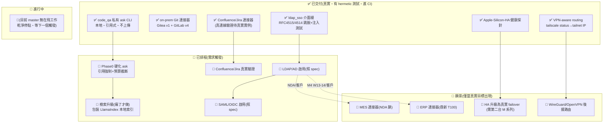

> ARCHIVED 2026-06-19 — 內容已併入 docs/phantom-enterprise.md;此為歷史版本。

# 路線圖(繁體中文・視覺化)

> 🌐 英文權威版本(狀態唯一真實來源 SSOT):**[`ROADMAP.md`](ROADMAP.md)**。
> 本檔為繁中導覽 + 視覺化路線圖,**狀態以英文 `ROADMAP.md` 為準**;方向選型參考
> **[`docs/OSS-LANDSCAPE-AND-DIRECTION.md`](docs/OSS-LANDSCAPE-AND-DIRECTION.md)**。
> 最後更新 **2026-06-19**。

---

## ① 定位 + 護城河

**一句話定位:** phantom-mesh 的 **企業 on-prem 連接器套件** — 讓個人 mesh 無痛
延伸進公司內網(SSO / VPN / 內部 GitLab / Confluence / MES / ERP),且
**資料不離開機器**。

**護城河(別人不做、做了也輸的角度):**

- 🔒 **隱私優先 + 本地落地:** `code_qa ask` 在本機讀程式碼、本機 `phantom exec`
  回答、強制引用檔案路徑 — 程式碼位元組永不上傳。對比 Glean(雲端、閉源、
  $25–50+/人/月)這就是區隔。
- 🕸️ **mesh 原生:** 騎在 phantom-mesh 的跨裝置 dispatch 上,不是另一套要部署
  營運的平台。Onyx / Dify / RAGFlow 是「要架起來營運的產品」;本專案是「嵌進我
  已擁有的 mesh 的薄膠水」。
- 🏭 **台廠 + on-prem + Apple Silicon HA 形狀:** Tailscale subnet router、自架
  Gitea/GitLab、鼎新 T100、鴻海 MES 是一等公民,不是 marketplace 第三方 plugin。
- 👤 **單人可擁有:** 不需 worker 機群 / 向量 DB 服務 / web UI 就能跑。

> 詳細選型理由見 `docs/OSS-LANDSCAPE-AND-DIRECTION.md`:**參考** Onyx 的連接器
> 形狀與引用式回答,**必要時才包裝** LlamaIndex 當本地檢索層,**絕不採用**任何
> RAG 框架當主幹(會把 phantom-mesh 換掉、毀掉利基)。

---

## ② 狀態流(Mermaid)

圖例:✅ 已交付　🚧 進行中　📅 已排程(需求觸發)　🔭 願景/僅當有真實目標

**七大連接器盤點:** 4 個真實(vpn-routing / on-prem-git / confluence-jira /
apple-silicon-ha 探針)、1 個刻意介面縫(ldap-sso)、2 個 0-LOC 佔位
(mes / erp)。`code_qa` 私有 ask CLI 不在原七個內,但已真實且為套件入口。

---

## ③ 分期表

> 排序原則(依單人多機開發模型):**便宜高值先 → 護城河先 → 需整合外部系統/
> 操作者決策的最後做**。寫=codex/claude,審≥2 distinct-AI,governor+雙閘→手機。
> 機台:z13(主・Windows)/ M5 / M1 / acer / ayaneo / Android。

| 階段 | 目標 | 具體項(2–4) | 在哪台機 + 哪 AI | 風險前置 |
|---|---|---|---|---|
| **P0 硬化膠水** 🟢便宜高值 | 強化既有利基,零外部依賴 | ・`ask` 強制引用檢查 ・repo 超窗時 token 預算+截斷提示 ・文件化「資料只在本機」路徑 | z13 寫=codex/claude;審=opencode+agy | 純本地、無外部系統;可立即做、可逆 |
| **P1 真實驗證**(已建之物)🛡️護城河 | 把已是真實的連接器對真實實例跑 | ・Confluence/Jira 對真 Atlassian ・GitLab 連接器對真 self-hosted | acer/ayaneo 跑連線;z13 orchestrate;審≥2 AI | ⚠️ **需操作者拿到真實企業實例**(觸發見英文 ROADMAP);無實例不啟動 |
| **P2 檢索升級**(痛了才做)⚙️ | 單 prompt 塞檔失效時才升級 | ・包裝 **LlamaIndex** 本地索引層(候選方向) ・本地 chunk + top-k,仍走 `phantom exec` + 引用 | z13/M5 寫=codex;審=claude+agy | ⚠️ **只在實測 overflow 後做**;勿提前建向量 DB/embedding(over-build) |
| **P3 IdP 啟用** 🔑需外部 | 對真 AD/IdP 實作認證 | ・`LdapAuth.authenticate`(照 `docs/ldap-activation-spec.md`) ・`SamlAuth`/`OidcAuth`(照 `docs/saml-oidc-spec.md`) | z13 寫;審≥2 AI;高風險→governor 強制暫停→手機核准 | ⚠️ **需真實目錄/IdP + 操作者決策**;保住 `AuthBackend` 契約 |
| **P4 NDA 連接器** 🔭最後 | MES/ERP 僅在 NDA/客戶內 | ・MES(鴻海/南亞科 schema) ・ERP(鼎新 T100 唯讀先) | 進大廠後該公司環境;審≥2 AI | ⚠️ **schema NDA 鎖、需操作者就職/客戶**;對零實例寫=禁 |

---

## ④ 刻意不做 / over-build 防線

| ❌ 不做 | 為什麼 |
|---|---|
| 變成「另一個 Onyx / Dify」(web UI + worker 機群 + 向量 DB 服務 + 連接器市集) | 對上 30k–146k★ 全職團隊必輸;利基是「我擁有的 mesh 上的薄膠水」,刻意放棄廣度 |
| 採用 LangChain/LlamaIndex 當**主幹框架** | phantom-mesh 的 `phantom exec` 已是 agent 基座;換掉它=退化成通用 RAG app、毀掉跨裝置+隱私區隔(LlamaIndex 只在 P2 痛點時**薄包裝**) |
| 提前建 embedding / 向量庫 / rerank | naive 塞 prompt 在真實語料 overflow 前是**正確**的;提前建=真實維運成本換零收益 |
| 對零真實實例寫 MES/ERP/IdP 連接器 | 經典 enterprise scaffold 陷阱:寫了永遠無法驗證、會爛掉;一律需求觸發 |
| 完整取代 AD / 重做 ERP 全功能 | 本專案是「接」不是「取代」;只接資料/觸發 |
| 為了看起來忙而製造工作 | 若無需求信號,**維持 scaffold 是可接受結局** — repo 已證明 mesh 可乾淨延伸到企業 |

---

*繁中導覽。狀態權威 = [`ROADMAP.md`](ROADMAP.md);方向選型 =
[`docs/OSS-LANDSCAPE-AND-DIRECTION.md`](docs/OSS-LANDSCAPE-AND-DIRECTION.md)。
作者:Mark Lai([@markl-a](https://github.com/markl-a))。*
