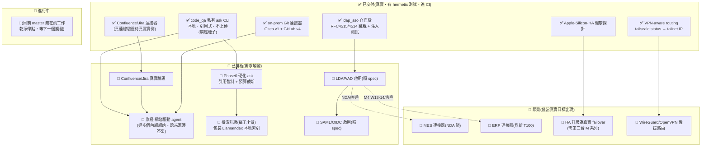

# phantom-enterprise — 唯一主文件

> 本檔為 phantom-enterprise 唯一主文件;舊版見 `docs/_archive/`。
> 對應狀態:`master` @ `256ff5c`。誠實定調:七大連接器中 **4 個真實**(VPN-aware routing / on-prem Git / Confluence-Jira / Apple-Silicon-HA 探針)、**1 個刻意介面接縫**(ldap/sso)、**2 個 0-LOC 佔位**(mes / erp);另有 `code_qa` 私有 `ask` CLI(本機、引用式、不上傳)為套件入口,也是旗艦的「種子」。每個「已出貨」項都對應 `master` 上的真實 commit。旗艦 agent「整內網」版仍在路上。

## 目錄

從上到下,這份文件就是一個故事:**先講問題,再講解法,再講旗艦能力,再講為什麼可信,再講為什麼要做這些玩具版,最後是誠實現況與路線圖。**

1. [它解決什麼問題](#它解決什麼問題)
2. [解法(一句話)](#解法一句話)
3. [旗艦:內網網站驅動的 agent(含例子)](#旗艦內網網站驅動的-agent含例子)
4. [為什麼可信(護城河)](#為什麼可信護城河)
5. [為什麼有這些玩具版(demo 舞台)+ 清單與誠實狀態](#為什麼有這些玩具版demo-舞台--清單與誠實狀態)
6. [快速上手](#快速上手)
7. [狀態與視覺路線圖](#狀態與視覺路線圖)
8. [開源生態與方向](#開源生態與方向)
9. [刻意不做 / over-build 風險](#刻意不做--over-build-風險)

---

## 它解決什麼問題

公司裡有一大堆**內網工具**:內部 GitLab、Confluence、Jira、內部 wiki、入口網站,工廠還有 MES(製造執行系統)、ERP。這些工具裡裝著公司最敏感的資料。

大家都想用 AI 來幫忙 —— 問一句話,就有人幫你把這些系統裡的東西讀出來、湊成答案。但有一個過不去的坎:

> **不能把內網資料丟到雲端 AI。**

不行的原因很實在:隱私、合規、法規不允許。很多公司明文規定內部程式碼、客戶資料、製程資料一個位元組都不能離開公司網路。

那市面上的方案呢?

- **Glean** —— 純雲端、閉源、每人每月 $25–50 起跳。資料要上它的雲,而且你完全看不到原始碼、控制不了。
- **Onyx / Dify / RAGFlow** —— 雖然開源,但是「**一整套要整個團隊維運的平台**」:Postgres + 向量資料庫 + 背景 worker + web UI,光架起來、養起來就是一份工作。

結論:**單人、或一間小公司,要嘛只能把資料交給雲端(不行),要嘛得養一套重到爆的平台(養不起)。中間這塊缺口,沒人填。**

---

## 解法(一句話)

**phantom-enterprise = 一個跑在公司自己機器上的 AI agent,會讀、會操作你的內網工具,而資料一個位元組都不離開公司。**

它不是雲端服務,也不是一套要整團隊維運的平台。它是一層**輕薄、隱私優先、跑在 phantom-mesh 上**的膠水:把公司內網的各個系統接起來,讓一個地端 AI agent 能去讀、去操作,然後在本機回答你。

賣點**不是「功能多」,而是「小、私密、單人就能架、就能擁有、資料不外流」。**

它是 phantom-mesh BIG-GOAL **P1 跨平台連線**的企業變體,並服務 **P4 加密為先**(VPN-aware routing 強制流量走 Tailscale / 公司 VPN)。以 Python 撰寫,封裝為 `phantom-enterprise`,套件入口是 `code_qa.cli`。

---

## 旗艦:內網網站驅動的 agent(含例子)

這套東西的**主角(旗艦)是「內網網站驅動的 agent」**:你問它一個問題,它**自己去逛公司的內網**(內部 GitLab、Confluence、Jira、wiki…),跨好幾個來源湊出一個**附引用來源**的答案 —— 而且全程在公司機器上跑,資料不出去。

### 一個具體例子

想像你在公司,問它:

> 「上週 OO 專案的部署為什麼失敗?」

它會自己做這幾件事(全程在公司機器上):

1. 去讀**內網 GitLab** 的 CI log —— 看哪個 job 紅了;
2. 去翻 **Confluence** 上那條部署的 runbook —— 看正確流程該怎麼跑;
3. 去查 **Jira** 上相關的 ticket —— 看有沒有人記過已知問題;
4. 把這些湊起來,給你一個**有引用來源**的答案:「失敗是因為 X,根據 GitLab job #123 的 log + Confluence 頁面 Y + Jira 票 Z」。

關鍵就一句:**這些公司內部的資料,從頭到尾都沒有離開這台機器、沒有上傳到任何雲端。**

### 旗艦的「種子」已經出貨了:`code_qa` 私有 `ask` CLI

旗艦聽起來很大,但它的**核心種子已經是真實、可跑的程式碼** —— 就是 `code_qa` 的私有 `ask` CLI。它把旗艦的隱私論旨,濃縮成一項今天就能用的工具:

- **本機讀取** —— 在這台機器上(或透過地端 Gitea/GitLab 連接器)讀程式碼/文件;
- **強制引用** —— 用一個強制引用的提示詞模板(`PROMPT_TEMPLATE`:「僅使用所提供的檔案內容……並引用檔案路徑」)來建構問題,逼 agent 講出處;
- **本機執行** —— 透過一個**本機 `phantom exec` 代理**回答;
- **位元組永不離開機器** —— 程式碼/文件的內容絕不上傳。

```bash
# --repo 為必填(本機路徑 / Gitea owner/repo / GitLab project id),問題接在後面
phantom-enterprise ask --repo /path/to/your/repo "How does X work?"
```

換句話說:**今天 `ask` 能對「一個 repo」做的事(本機讀 → 強制引用回答 → 不外流),旗艦就是把它擴大到「整個公司的內網網站」。** 旗艦 = `ask` 的隱私模型 ×「會讀、會逛多個內網網站」的 agent 能力。

> 旗艦本身的狀態(誠實):種子(`ask` + 它已能接的 toy Git / Confluence-Jira 連接器)**已出貨**;但把 agent 從「讀一個 repo」擴大到「**自己逛多個內網網站、跨來源湊答案、甚至按按鈕做任務**」的完整旗艦,**仍在路上**(需求觸發,見路線圖 P1.5)。

---

## 為什麼可信(護城河)

為什麼相信這條路走得通、別人搶不走?四個角度:

- 🔒 **隱私優先 + 本地落地。** `ask` 在本機讀、本機回答、強制引用、程式碼位元組永不上傳。對比 Glean(雲端、閉源、每人每月 $25–50+),這就是整套差異化的核心。
- 🕸️ **mesh 原生。** 它騎在 phantom-mesh 的跨裝置 dispatch 上,**不是另一套要部署、要營運的平台**。Onyx / Dify / RAGFlow 是「要架起來營運的產品」;本專案是「嵌進我已擁有的 mesh 的薄膠水」。
- 🏭 **台廠 + on-prem + Apple Silicon HA 形狀。** Tailscale subnet router、自架 Gitea/GitLab、鼎新 T100、鴻海 MES 是一等公民,不是 marketplace 上的第三方 plugin。招聘標的:鼎新 / 中信 / 國泰 / 鴻海 / 聯發科 / 仁寶 / 廣達 / 緯創。
- 👤 **單人可擁有。** 不需 worker 機群 / 向量 DB 服務 / web UI 就能跑。

一句話:**它不跟大平台拚廣度,而是拚「小、私密、單人就能擁有、資料不外流」。** 這正是 Glean(雲端、太貴)和 Onyx/Dify(太重)中間那塊沒人填的缺口。

---

## 為什麼有這些玩具版(demo 舞台)+ 清單與誠實狀態

### 為什麼要做這些 toy 版?

旗艦要在內網上跑給人看,問題是 —— **真實的企業內網,一般人根本拿不到。** 你沒辦法叫鴻海借你 MES、叫某公司借你正式 GitLab 來示範。

所以解法是:**自己做出各系統的「玩具版」(toy/demo 版),當作示範舞台。** toy GitLab/Gitea、toy Confluence/Jira、toy LDAP-SSO、toy MES/ERP、Apple-Silicon-HA 探針、VPN-aware routing —— 它們存在的理由**不是要做產品,而是要 demo 旗艦能力**:讓 agent 在這些玩具版上實際跑一遍,證明「一個地端 AI agent 真的能讀、能操作公司內部系統,而資料不外流」。

把它們湊在一起,就是一個自成一體的 demo 舞台。下面每一列,都是「公司某個內網系統的玩具版」,是旗艦 agent 會去操作的對象。

### 清單與誠實狀態

狀態標示**誠實、不灌水**:✅ 真實(有密封測試、進 CI)/ 🧩 介面接縫(契約真、後端待真實目標)/ ⬜ 佔位(0-LOC)。

| 玩具版 | 它示範什麼(agent 拿它做什麼) | 狀態 |
|---|---|---|
| **toy 內網 Git(GitLab / Gitea)** | agent 去讀內網 Git 上的程式碼、CI log、commit;`ask` 已能以 Gitea(`/api/v1`)或 GitLab(`/api/v4`)為來源回答 | ✅ **真實**:真實 HTTP + auth + 密封測試 |
| **toy Confluence / Jira** | agent 去讀內網 wiki 頁面(`search_pages`/`get_page`)、查/留 Jira ticket(`list_issues`/`add_comment`) | ✅ **真實**(8 個密封測試);⚠️ **對真實 Atlassian 的現場驗證誠實延後** |
| **toy LDAP / SSO 登入** | 讓 agent 用公司帳號登入(LDAP / SAML / OIDC),拿到身分與群組 | 🧩 **介面接縫**:契約(`AuthBackend`/`AuthResult`)+ 注入安全部分(RFC 4515/4514 跳脫)為真實;真 IdP 前拋 `NotImplementedError` |
| **toy MES(製造執行系統)** | agent 讀廠端 MES 資料(鴻海 / 南亞科 schema) | ⬜ **佔位**(0-LOC、NDA 鎖) |
| **toy ERP(鼎新 T100)** | agent 讀 ERP 資料(先唯讀) | ⬜ **佔位**(0-LOC、需客戶/就職) |
| **Apple-Silicon-HA 探針** | 示範地端高可用(M 系列 active/standby 的健康探針 + failover 決策) | ✅ **真實**:可注入健康探針 + 密封測試;runbook 見 `docs/apple-silicon-ha-deploy.md` |
| **VPN-aware routing** | 讓 agent 跨公司網段找到節點,並強制流量走 Tailscale / 公司 VPN(資料不外流的傳輸層) | ✅ **真實**:`tailscale status --json` → tailnet IP,缺席時優雅降級 |

> **一句總結:4 個真實(內網 Git / Confluence-Jira / Apple-Silicon-HA 探針 / VPN-routing)、1 個介面接縫(LDAP-SSO)、2 個佔位(MES / ERP)**,外加已出貨的 `code_qa ask` CLI(旗艦種子)。「真實」= 有密封式測試、納入 CI(`.github/workflows/ci.yml` 跑 `pytest`)的可運作程式碼。`ask` 不在原七個連接器內,但已真實且為套件入口,也是旗艦「網站驅動 agent」的種子。

---

## 快速上手

### Quickstart

```bash
git clone https://github.com/markl-a/phantom-enterprise
cd phantom-enterprise
pip install pytest requests
pytest -v
```

密封式(hermetic)測試套件**完全離線**執行;真實連接器在 Tailscale 或某 on-prem host 缺席時**優雅降級**(回傳無路由,絕不崩潰)。CLI 入口是 `phantom-enterprise`(`code_qa.cli`)。

### 私有 `ask`(隱私論旨濃縮於一項工具,也是旗艦種子)

```bash
# 本機讀某 repo 並就其內容回答(程式碼位元組永不離開機器);--repo 必填,問題接在後面
phantom-enterprise ask --repo /path/to/your/repo "How does X work?"

# 透過地端連接器:Gitea(把 --repo 當 owner/repo) 或 GitLab(把 --repo 當 project id)
phantom-enterprise ask --repo owner/repo "..." --gitea --base-url <gitea-url> --token <tok>
phantom-enterprise ask --repo group/name "..." --gitlab --base-url <gitlab-url> --token <tok>

# 狀態:真實 auth + HA 探針(不再永遠回報 DEGRADED)
phantom-enterprise status
phantom-enterprise --version
```

`--repo` 為必填(本機路徑 / Gitea owner/repo / GitLab project id);`--gitea`/`--gitlab`/`--base-url`/`--token` 為修飾旗標。`ask` 在本機讀取儲存庫、建構強制引用的有所本提示詞、透過本機 `phantom exec` 代理回答。`status` 跑真實 auth + HA 探針;入口已產品化(`--version`、優雅中斷/管線處理)。

### 30 秒 demo(自架 asciinema,無第三方追蹤)

```sh
# 在終端機播放(需 asciinema)
asciinema play docs/demo.cast

# 或不裝工具直接看擷取文字:
cat docs/demo.cast | jq -r '.[] | select(.[1]=="o") | .[2]'
```

`docs/demo.cast` 錄的是運作中的 VPN-aware routing 連接器(`tailscale_route()`);demo 用不存在的 host,故 cast 中不洩漏真實 tailnet IP。**刻意自架** —— 不上傳 asciinema.org、無第三方追蹤。

> 前瞻設計(設計意圖、非狀態):`docs/ldap-activation-spec.md`、`docs/saml-oidc-spec.md`、`docs/apple-silicon-ha-deploy.md`、`docs/vpn-mesh-demo.md`。

---

## 狀態與視覺路線圖

> 排序原則:① **便宜高值優先** ② **護城河優先於廣度** ③ 需真實外部系統 / 操作者決策的**排後並標明** ④ 明列**刻意不做**。
> 啟用是**需求閘控(demand-gated),不是 effort-gated** —— 每個未建項在其真實目標(真實實例 / 客戶 / 就職)出現前皆不啟動。每個「已出貨」項對應 `master` 上的真實 commit(對照工作樹與合併歷史驗證,非願景)。「真實」= 有密封式測試、納入 CI(`.github/workflows/ci.yml` 跑 `pytest`)的可運作程式碼。

### 狀態總覽(Mermaid)



### ✅ 已出貨(grounded,對應真實 commit)

| 項目 | 具體內容 | 對應 commit / 證據 |
|---|---|---|
| VPN-aware routing | `tailscale status --json` → 短主機名解析 tailnet IP + 列 peers;Tailscale 缺席回傳無路由(不崩潰)。UTF-8 解碼避免 Windows cp950 崩潰;MagicDNS 首段比對錨定可信 `*.ts.net` 後綴 | `6927213` `9585455` `b86bae4` |
| on-prem Git 連接器 | live Gitea(`/api/v1`)+ provider-aware GitLab v4(`/api/v4`),真實 HTTP + auth + 密封測試;hardcoded tailnet IP 已清除,base URL 改 env-driven | `1c96413` `44d22bb` `99d6cd3` |
| Confluence / Jira 連接器 | `search_pages`/`get_page`/`list_issues`/`add_comment` over Atlassian REST + Basic-auth,鏡像 Gitea 連接器;8 個密封測試(現場驗證誠實延後) | `0d1306d` `3c8d3d6` |
| 私有 `ask` CLI(`code_qa`,旗艦種子) | 本機(或經地端 Gitea/GitLab)讀 repo、本機 phantom 代理回答(碼不離機);GitLab source mode 接入 `ask`;`status` 跑真實 auth+HA 探針;入口產品化(`--version`、優雅中斷/管線) | `d7dee9b` `677700f` `476140a` `7b267e8` `7671896` |
| Apple Silicon HA 探針 | 可注入健康探針(launchd / port / peer-reachable / failover 決策)+ 密封測試;deploy runbook 見 `docs/apple-silicon-ha-deploy.md` | `bd7a7a9` |
| ldap/sso 介面接縫 | `AuthBackend`/`AuthResult` 契約 + `LdapAuth`/`SamlAuth`/`OidcAuth`(真 IdP 前拋 `NotImplementedError`);**注入敏感部分為真實**:RFC 4515/4514 filter + DN 跳脫 + 合約測試 + NUL/控制字元跳脫 | `7048911` `0431f7d` |
| Project plumbing | Apache-2.0 LICENSE;GitHub Actions pytest workflow + CI badge;setuptools 多套件佈局;自架 asciinema demo cast(無第三方追蹤) | `ebcec96` `a3c8b89` `65100f2` `31eb80f` |

> 目前:七大連接器中 **4 個真實**(vpn-routing / on-prem-git / confluence-jira / apple-silicon-ha 探針)、1 個刻意介面縫(ldap-sso)、2 個 0-LOC 佔位(mes / erp)。`code_qa` 私有 `ask` CLI 不在原七個內,但已真實且為套件入口,也是旗艦「網站驅動 agent」的種子。

### 🚧 進行中

目前 `master` 無在飛工作。最後落地工作(2026-06-18)把 GitLab 連接器接入 `ask` CLI 路徑。repo 處於乾淨停點,等下一個啟用觸發。

### 📅 分期表(需求閘控)

> 排序原則:**便宜高值先 → 護城河先 → 需整合外部系統 / 操作者決策的最後做**。寫 = codex/claude,審 ≥2 distinct-AI,高風險 → governor + 雙閘 → 手機核准。機台:Win 編排機(主)/ Mac 節點 ×2 / Win 節點 ×2 / Android worker。

| 階段 | 目標 | 具體項 | 在哪台機 + 哪 AI | 風險 / 觸發前置 |
|---|---|---|---|---|
| **P0 硬化膠水** 🟢便宜高值 | 強化既有利基,零外部依賴 | ・`ask` 強制引用檢查<br/>・repo 超窗時 token 預算 + 截斷提示<br/>・文件化「資料只在本機」路徑 | Win 編排機 寫 = codex/claude;審 = opencode + agy | 純本地、無外部系統;**恆常啟用**、可立即做、可逆 |
| **P1 真實驗證**(已建之物)🛡️護城河 | 把已是真實的連接器對真實實例跑 | ・Confluence/Jira 對真 Atlassian<br/>・GitLab 連接器對真 self-hosted | Win 節點 跑連線;Win 編排機 orchestrate;審 ≥2 AI | ⚠️ **需操作者拿到真實企業實例**;無實例不啟動 |
| **P1.5 旗艦:網站驅動 agent** 🚩主角 | 把 `ask` 從「讀一個 repo」擴大到「逛多個內網網站、跨來源湊答案」 | ・讓 agent 串接 toy Confluence/Jira/GitLab 連接器跨來源回答<br/>・(若需逛 HTML 介面)薄包裝一個瀏覽器/網頁 agent,藏在自家介面後 | Win 編排機 寫 = codex/claude;審 ≥2 AI | ⚠️ **需 P1 真實實例先就緒**;先用連接器(API)跑,瀏覽器驅動只在 API 不夠時才加(over-build 警戒) |
| **P2 檢索升級**(痛了才做)⚙️ | 單 prompt 塞檔失效時才升級 | ・包裝 **LlamaIndex** 本地索引層(候選方向)<br/>・本地 chunk + top-k,仍走 `phantom exec` + 引用 | Win 編排機/Mac 節點 寫 = codex;審 = claude + agy | ⚠️ **只在實測 overflow 後做**;勿提前建向量 DB/embedding(over-build) |
| **P3 IdP 啟用** 🔑需外部 | 對真 AD/IdP 實作認證 | ・`LdapAuth.authenticate`(照 `docs/ldap-activation-spec.md`)<br/>・`SamlAuth`/`OidcAuth`(照 `docs/saml-oidc-spec.md`) | Win 編排機 寫;審 ≥2 AI;高風險 → governor 強制暫停 → 手機核准 | ⚠️ **需真實目錄/IdP + 操作者決策**;保住 `AuthBackend` 契約 |
| **P4 NDA 連接器** 🔭最後 | MES/ERP 僅在 NDA/客戶內 | ・MES(鴻海/南亞科 schema)<br/>・ERP(鼎新 T100 唯讀先) | 進大廠後該公司環境;審 ≥2 AI | ⚠️ **schema NDA 鎖、需操作者就職/客戶**(M4 W13-14 ~2026-08);對零實例寫 = 禁 |

> 此外:**WireGuard / OpenVPN 後援路由**(P4.2)延後 —— Tailscale 是唯一已示範的 VPN-aware 路徑(觸發:live WireGuard/OpenVPN infra)。**Apple Silicon HA 升級為真實 failover** 需第二台 M 系列節點。
> 圖例:✅ 已交付 ｜ 🚧 進行中/近期 ｜ 📅 之後(需求觸發) ｜ 🔭 願景 ｜ 🔴 高風險 ｜ ⚠️ over-build / 外部依賴警戒

> **若無需求訊號到來,維持 scaffold 是可接受結局** —— repo 已證明 phantom-mesh 架構可乾淨延伸到企業 on-prem 需求。狀態衝突一律以本節 + `docs/_archive/` 的英文 ROADMAP 解析;前瞻設計意圖(`docs/_archive/` 的 `05-phantom-enterprise.md` 與各 spec)為設計意圖,非狀態。

---

## 開源生態與方向

> 範圍:phantom-enterprise 在開源**企業知識 / 內部文件 RAG / 內部問答代理 / 網頁操作 agent**生態中的定位,及對一個單人、整合 phantom-mesh、隱私優先專案的建議方向。**狀態主張以上方〈狀態與視覺路線圖〉為準;本節談方向,非狀態。** 每項外部主張標註於 **2026-06**;星數 / 授權會漂移,凡無法對照標準儲存庫確認者以 `[unverified]` 標示。

**核心論點:保持隱私優先、mesh 原生、台廠 on-prem 形狀的輕薄連接器套件 + 本機有所本問答黏合層原樣不動,並停止試圖在工程上勝過大型 RAG 平台。領先者是用來*運行*的產品;phantom-enterprise 是用來*嵌入*我已擁有之 mesh 的黏合層。不要重造一個平台。**

### 2a. 完整企業搜尋 / 內部問答平台(「全包」層級)

| 專案 | URL | 星數 `[~2026-06]` | 語言 | 授權 | 成熟度 | 對單人 mesh 隱私優先專案的契合 / 落差 |
|---|---|---|---|---|---|---|
| **Onyx**(前 Danswer) | github.com/onyx-dot-app/onyx | ~30k | Python | **MIT**(CE) | 生產級;代理式 RAG、40–50+ 連接器、MCP、Deep Research | **最接近的直接對照。** 已具 Confluence/Jira/Slack/GitHub/GitLab 連接器 + RAG + 存取控制可自架。**落差:** 沉重多服務堆疊(Postgres + Vespa/向量 + worker + web UI)= *要部署運維的產品*,非可嵌入 mesh 的函式庫。是連接器形狀與有所本回答 UX 的**參考標竿**。 |
| **Dify** | github.com/langgenius/dify | ~146k | TypeScript | **Dify OSS License**(Apache-2.0 + 多租戶/品牌限制) | 非常成熟;代理 + RAG + 工作流 studio + LLMOps | 龐大精緻,屬**平台/BaaS**,授權帶商業條件、非純 OSS。對自架 Apache-2.0 單人利基過度且授權不匹配。僅作工作流編排 UX 參考。 |
| **RAGFlow** | github.com/infiniflow/ragflow | ~83k | Python | **Apache-2.0** | 成熟;深度文件理解 RAG、可追溯引用 | 同類最佳*文件解析/切塊與可解釋引用*。**落差:** 完整 RAG 引擎(DeepDoc 解析器、infinity/elastic 儲存、web UI)= 要運行的服務。若 `code_qa` 日後需更豐富文件擷取,是引用模型的有力**候選參考**。 |
| **Quivr** | github.com/QuivrHQ/quivr | ~39k | Python | **Apache-2.0**(核心)`[unverified exact]` | 成熟「第二大腦」RAG 框架 | 隱私友善、可自架、任意 LLM/向量庫。偏**個人知識**定調。本機優先理念參考;非連接器來源。 |
| **Glean** | glean.com(專有) | n/a(封閉) | — | **專有、SaaS** | 市場領導者,企業搜尋 | phantom-enterprise 用以*界定自身*的商業基準線:每人每月 $25–50+、僅雲端、不可自架、無原始碼。**整套差異化** = 自架 + 資料不外流 + 單人可掌控。不可採用;它是反襯。 |

### 2b. RAG 構件函式庫(「自行組合」層級)

| 專案 | URL | 星數 `[~2026-06]` | 語言 | 授權 | 成熟度 | 契合 / 落差 |
|---|---|---|---|---|---|---|
| **LangChain / LangGraph** | github.com/langchain-ai/langchain | ~119k `[unverified]` | Python | **MIT** | 成熟、龐雜 | 可提供檢索/代理管線,但相依面龐大且變動頻繁。phantom-mesh **已**提供代理基底(`phantom exec`),引入只會重複造輪。**參考,勿採用。** |
| **LlamaIndex** | github.com/run-llama/llama_index | ~50k | Python | **MIT** | 成熟;300+ 資料連接器/載入器、檢索能力強 | 若 `code_qa` 超出「把檔案塞進單一提示詞」階段,這是最*符合用途*的構件:階層式切塊、子問題拆解、300+ 載入器。**值得包裝的候選**,作為*本機*索引/檢索層藏在自己介面後,非由框架接管。 |
| **Cognita**(TrueFoundry) | github.com/truefoundry/cognita | ~4.4k | Python | **Apache-2.0** | 模組化;至 2026 仍活躍 | 帶 UI 可比較設定的模組化 RAG。心智佔有率較小、綁 TrueFoundry 部署敘事。可作*模組化元件邊界*參考;對 mesh 原生單人套件採用價值低。 |

### 2c. 瀏覽器 / 網頁操作 agent(旗艦「網站驅動 agent」的角度)

> 旗艦的理想形態,是 agent 能「逛」內網網站。許多內網系統有 REST API(GitLab/Confluence/Jira 都有,我們已用 API 連接器),**優先走 API**;只有當某內網工具**只有 HTML 介面、沒有 API** 時,才需要一個「瀏覽器驅動」能力。下列是可作*參考/薄包裝候選*的真實 OSS(星數/授權為 2026-06 概略快照):

| 專案 | URL | 星數 `[~2026-06]` | 語言 | 授權 | 契合 / 落差 |
|---|---|---|---|---|---|
| **browser-use** | github.com/browser-use/browser-use | ~95k `[unverified]` | Python | **MIT** `[unverified exact]` | 最熱門的 OSS「LLM 驅動瀏覽器」框架:用自然語言下目標,agent 自己點/打字/導航。**最有力的薄包裝候選**(若旗艦需逛純 HTML 內網)。Python + MIT 對齊本專案。**參考/wrap,勿採用為脊柱。** |
| **Stagehand**(Browserbase) | github.com/browserbase/stagehand | `[unverified]` | TypeScript / Python | **MIT** `[unverified]` | 在 Playwright 上加 AID(act/extract/observe/agent),走「確定性優先」路線、較易讀可控。TS 為主與本專案 Python 形狀略偏。介面設計參考。 |
| **Skyvern** | github.com/Skyvern-AI/skyvern | `[unverified]` | Python | `[unverified]` | LLM + 電腦視覺自動化瀏覽器流程,Playwright 相容 SDK + 無碼工作流;表單填寫強。**參考**(視覺式驅動的形狀)。 |
| **Playwright** | github.com/microsoft/playwright | `[unverified]` | 多語言 | **Apache-2.0** `[unverified]` | 底層瀏覽器自動化引擎(非 AI agent);上面三者多半建構於其上。若真要本機驅動瀏覽器,這是可信的*基底*。 |

> ⚠️ **網站驅動 = 雙刃**:瀏覽器驅動很炫但維護成本高(內網頁面改版就壞)、且 agent 在公司網站上「按按鈕做任務」風險高(需 governor + 雙閘 + 手機核准)。**裁決:優先用 API 連接器跑旗艦;瀏覽器驅動只在「某內網工具無 API」這個真實痛點出現時,才薄包裝 browser-use 之類藏在自家介面後** —— 同 LlamaIndex 的 WRAP 原則,絕不讓它變框架。

### 對 phantom-enterprise 的啟示與裁決

| 裁決 | 對象 | 理由 |
|---|---|---|
| **BUILD(保留)** | 輕薄連接器套件(`vpn_aware_routing`、`on_prem_gitlab`、`confluence_jira`、`ldap_sso` 接縫、`apple_silicon_ha`)+ `code_qa` 本機有所本 `ask`(旗艦種子) | 這*就是*利基:隱私優先、mesh 原生、單人可掌控、無平台需運維。§2 中無任何專案佔據「乘載於 phantom-mesh 之上、地端-台廠-形狀的輕薄套件」 |
| **REFERENCE** | **Onyx** 連接器合約 + 有所本回答/引用 UX;**RAGFlow** 可解釋引用模型;**browser-use / Stagehand / Skyvern** 網站驅動形狀 | 偷其*形狀*(連接器介面、「引用你的來源」回答格式、自然語言驅動瀏覽器的介面),不繼承其堆疊。`PROMPT_TEMPLATE` 已映照引用點 —— 持續對齊 |
| **WRAP(僅在真實需求逼迫時)** | (a) repo 溢出單一 prompt 時,把 **LlamaIndex** 作為*本機*檢索/索引層藏在自家介面後;(b) 某內網工具**無 API** 時,把 **browser-use** 之類瀏覽器驅動薄包裝藏在自家介面後 | 從天真做法往上、最小且可信的一步;MIT、可本機跑。包裝輕薄子集 —— 絕不讓它變框架 |
| **ADOPT** | *(無整體採用)* | 不應採用任何專案為脊柱。`phantom exec` 已是代理/LLM 基底;採用 Onyx/Dify/RAGFlow/browser-use 為脊柱會*取代* mesh 而非延伸它 —— 破壞整套論旨 |

**為何不「直接部署 Onyx」?** Onyx(MIT,~30k★)已能對 Confluence/Jira/GitLab 內部問答,誘惑很真實。但採用它意味著:(1) 運行其多服務堆疊(違背「跑在我的 Mac/mesh 上、單人可掌控」)、(2) 放棄 phantom-mesh 代理基底與跨裝置調度,而那*正是產品本身*、(3) 繼承一條我無法掌控的連接器路線圖。**Onyx 是「好」長什麼樣子的參考、也是證明利基存在的反襯 —— 參考,永不採用。**

**務實階段路徑(映照分期表):** ① P0 強化黏合層(現在、零外部依賴:強制引用 + token 預算/截斷 + 本機資料路徑文件化)→ ② P1 現場驗證已屬真實之物(真 Atlassian/GitLab)→ ②.5 旗艦:用 API 連接器跨來源湊答案,必要時才薄包裝瀏覽器驅動 → ③ P2 檢索升級*僅在痛了之後*(LlamaIndex 本地索引)→ ④ P3 IdP + 地端驗證啟用 → ⑤ P4 受 NDA 閘控連接器(MES/ERP)。

> 來源(擷取於 2026-06):Onyx [repo](https://github.com/onyx-dot-app/onyx);Dify [repo](https://github.com/langgenius/dify);RAGFlow [repo](https://github.com/infiniflow/ragflow);Quivr [org](https://github.com/quivrhq);Cognita [repo](https://github.com/truefoundry/cognita);LangChain / LlamaIndex 比較;Glean pricing 分析;browser-use [repo](https://github.com/browser-use/browser-use);Stagehand [repo](https://github.com/browserbase/stagehand);Skyvern [repo](https://github.com/Skyvern-AI/skyvern);Playwright [repo](https://github.com/microsoft/playwright)。星數視為概略快照。

---

## 刻意不做 / over-build 風險

| ❌ 別做 | 原因 |
|---|---|
| ❌ 變成「另一個 Onyx / Dify」(web UI + worker 機群 + 向量 DB 服務 + 連接器市集) | 對上 30k–146k★ 全職團隊必輸;利基是「我擁有的 mesh 上的薄膠水」,**刻意放棄廣度** |
| ❌ 採用 LangChain/LlamaIndex/browser-use 當**主幹框架** | phantom-mesh 的 `phantom exec` 已是 agent 基座;換掉它 = 退化成通用 RAG/瀏覽器 app、毀掉跨裝置 + 隱私區隔(這些只在真實痛點時**薄包裝**藏在自家介面後) |
| ❌ 提前建 embedding / 向量庫 / rerank | naive 塞 prompt 在真實語料 overflow 前是**正確**的;提前建 = 真實維運成本換零收益。只在實測失敗時加(P2 觸發) |
| ❌ 提前建瀏覽器驅動 / 視覺 agent | 內網系統多半有 API(GitLab/Confluence/Jira 都有);**優先走 API**。瀏覽器驅動只在「某內網工具無 API」這個真實痛點出現時才薄包裝;且 agent 在內網網站上「做任務」高風險,需 governor + 雙閘 + 手機核准 |
| ❌ 對零真實實例寫 MES/ERP/IdP 連接器 | 經典 enterprise scaffold 陷阱:寫了永遠無法驗證、會爛掉;一律**需求觸發** |
| ❌ 完整取代 AD / 重做 ERP 全功能 | 本專案是「接」不是「取代」;只接資料 / 觸發 |
| ⚠️ 為了看起來忙而製造工作 | 若無需求信號,**維持 scaffold 是可接受結局** —— repo 已證明 mesh 可乾淨延伸到企業 |

**最大風險 = 範圍蔓延成通用 RAG 平台 / 「另一個 n8n」。** 一旦長出 web UI、背景 worker 機群、向量 DB 服務與連接器市集,就輸給有 30k–146k★ 與全職團隊的專案。利基是*我所擁有之 mesh 上的輕薄黏合層* —— 抵抗它。旗艦「網站驅動 agent」要守住同一條線:**先用 API 連接器,瀏覽器驅動只在真實痛點時薄包裝**。真實企業連接器(MES/ERP/IdP)是危險區:**需求閘控**、需真實目標 + 操作者決策、高風險走 governor + 雙閘 + 手機核准。各 `[unverified]` 標記在寫入程式碼/相依前皆應對照活躍倉庫確認。
